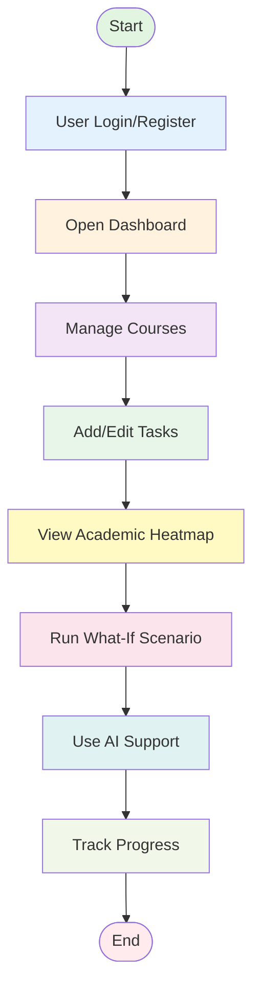
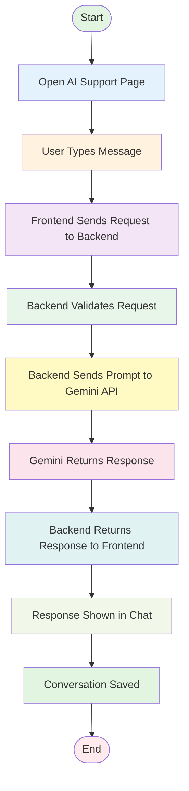

# Campus Task Manager - Simple Flowcharts

## Flowchart 1: Main User Flow



---

## Flowchart 2: AI Support Feature Flow



---

## How to Use These Flowcharts

### Option 1: View in Markdown Viewers
- GitHub automatically renders Mermaid diagrams
- VS Code with Mermaid extension
- Mermaid Live Editor: https://mermaid.live/

### Option 2: Export as Images
Use the Mermaid CLI to convert to PNG:
```bash
mmdc -i simple-flowcharts.md -o flowchart1.png
```

### Option 3: Recreate in Microsoft Word
1. Insert → SmartArt → Process
2. Choose "Basic Process" or "Vertical Process"
3. Add the following steps:

**Flowchart 1 Steps:**
1. Start
2. User Login/Register
3. Open Dashboard
4. Manage Courses
5. Add/Edit Tasks
6. View Academic Heatmap
7. Run What-If Scenario
8. Use AI Support
9. Track Progress
10. End

**Flowchart 2 Steps:**
1. Start
2. Open AI Support Page
3. User Types Message
4. Frontend Sends Request to Backend
5. Backend Validates Request
6. Backend Sends Prompt to Gemini API
7. Gemini Returns Response
8. Backend Returns Response to Frontend
9. Response Shown in Chat
10. Conversation Saved
11. End

### Option 4: Recreate in Draw.io / Lucidchart
1. Use rounded rectangles for Start/End
2. Use rectangles for process steps
3. Connect with arrows (top to bottom)
4. Use consistent spacing
5. Apply light colors for visual appeal

---

## Text-Based Representation

### Flowchart 1: Main User Flow
```
┌─────────────────┐
│     START       │
└────────┬────────┘
         │
         ▼
┌─────────────────┐
│ User Login/     │
│   Register      │
└────────┬────────┘
         │
         ▼
┌─────────────────┐
│ Open Dashboard  │
└────────┬────────┘
         │
         ▼
┌─────────────────┐
│ Manage Courses  │
└────────┬────────┘
         │
         ▼
┌─────────────────┐
│ Add/Edit Tasks  │
└────────┬────────┘
         │
         ▼
┌─────────────────┐
│ View Academic   │
│    Heatmap      │
└────────┬────────┘
         │
         ▼
┌─────────────────┐
│ Run What-If     │
│   Scenario      │
└────────┬────────┘
         │
         ▼
┌─────────────────┐
│ Use AI Support  │
└────────┬────────┘
         │
         ▼
┌─────────────────┐
│ Track Progress  │
└────────┬────────┘
         │
         ▼
┌─────────────────┐
│      END        │
└─────────────────┘
```

### Flowchart 2: AI Support Feature Flow
```
┌──────────────────────────┐
│         START            │
└────────────┬─────────────┘
             │
             ▼
┌──────────────────────────┐
│  Open AI Support Page    │
└────────────┬─────────────┘
             │
             ▼
┌──────────────────────────┐
│   User Types Message     │
└────────────┬─────────────┘
             │
             ▼
┌──────────────────────────┐
│ Frontend Sends Request   │
│      to Backend          │
└────────────┬─────────────┘
             │
             ▼
┌──────────────────────────┐
│ Backend Validates        │
│      Request             │
└────────────┬─────────────┘
             │
             ▼
┌──────────────────────────┐
│ Backend Sends Prompt     │
│    to Gemini API         │
└────────────┬─────────────┘
             │
             ▼
┌──────────────────────────┐
│  Gemini Returns          │
│     Response             │
└────────────┬─────────────┘
             │
             ▼
┌──────────────────────────┐
│ Backend Returns Response │
│     to Frontend          │
└────────────┬─────────────┘
             │
             ▼
┌──────────────────────────┐
│  Response Shown in Chat  │
└────────────┬─────────────┘
             │
             ▼
┌──────────────────────────┐
│  Conversation Saved      │
└────────────┬─────────────┘
             │
             ▼
┌──────────────────────────┐
│          END             │
└──────────────────────────┘
```

---

## Summary

These simplified flowcharts provide a clear, professional overview of:
1. **Main User Flow**: The complete journey through the Campus Task Manager system
2. **AI Support Flow**: The technical process of AI-powered chat assistance

Both flowcharts are designed to be:
- ✅ Simple and easy to understand
- ✅ Professional for documentation
- ✅ Suitable for university projects
- ✅ Easy to recreate in Word, PowerPoint, or draw.io
- ✅ Clean and visually appealing

