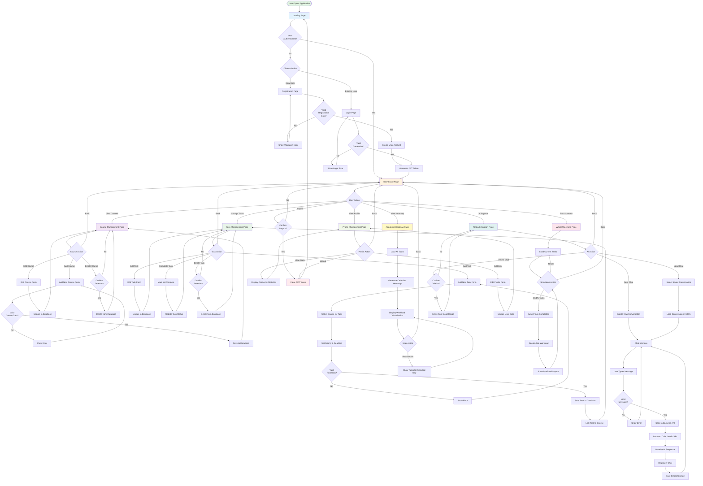

# Campus Task Manager - System Diagrams

## Diagram 1: Main System Flowchart



---

## Diagram 2: AI Support Feature Flowchart

```mermaid
flowchart TD
    Start([User Opens AI Support]) --> LoadPage[Load AI Assistant Page]
    LoadPage --> InitializeUI[Initialize Chat Interface]
    InitializeUI --> LoadStorage[Load Conversations from localStorage]
    LoadStorage --> CheckConversations{Conversations<br/>Exist?}
    
    CheckConversations -->|No| ShowEmpty[Show Empty State]
    ShowEmpty --> CreateFirst[Auto-create First Conversation]
    CreateFirst --> DisplayChat
    
    CheckConversations -->|Yes| DisplayList[Display Conversation List]
    DisplayList --> UserChoice{User Action}
    
    UserChoice -->|New Chat| CreateNew[Create New Conversation]
    CreateNew --> GenerateID[Generate UUID]
    GenerateID --> InitConversation[Initialize Empty Messages Array]
    InitConversation --> DisplayChat[Display Chat Interface]
    
    UserChoice -->|Select Existing| SelectConv[Select Conversation from List]
    SelectConv --> LoadConvData[Load Conversation Data]
    LoadConvData --> RenderMessages[Render Message History]
    RenderMessages --> DisplayChat
    
    UserChoice -->|Delete Chat| ConfirmDelete{Confirm<br/>Deletion?}
    ConfirmDelete -->|No| DisplayList
    ConfirmDelete -->|Yes| RemoveFromStorage[Remove from localStorage]
    RemoveFromStorage --> CheckRemaining{Other<br/>Conversations<br/>Exist?}
    CheckRemaining -->|Yes| LoadMostRecent[Load Most Recent]
    LoadMostRecent --> DisplayChat
    CheckRemaining -->|No| ShowEmpty
    
    DisplayChat --> WaitInput[Wait for User Input]
    WaitInput --> UserTypes[User Types Message]
    UserTypes --> ClientValidation{Client-Side<br/>Validation}
    
    ClientValidation -->|Empty Message| ShowClientError[Show Error: Message Required]
    ShowClientError --> WaitInput
    
    ClientValidation -->|Too Long| ShowLengthError[Show Error: Max 2000 chars]
    ShowLengthError --> WaitInput
    
    ClientValidation -->|Valid| CreateUserMsg[Create User Message Object]
    CreateUserMsg --> AddToConversation[Add to Conversation Array]
    AddToConversation --> UpdateTitle{First<br/>Message?}
    UpdateTitle -->|Yes| GenerateTitle[Generate Title from Message]
    GenerateTitle --> SaveTitle[Update Conversation Title]
    SaveTitle --> RenderUserMsg
    UpdateTitle -->|No| RenderUserMsg[Render User Message in UI]
    
    RenderUserMsg --> ShowLoading[Display Loading Indicator]
    ShowLoading --> ExtractContext[Extract Last 10 Messages]
    ExtractContext --> PreparePayload[Prepare API Request Payload]
    PreparePayload --> GetToken[Get JWT Token from Storage]
    GetToken --> SendRequest[Send POST to /api/ai-chat]
    
    SendRequest --> BackendReceive[Backend Receives Request]
    BackendReceive --> AuthMiddleware{JWT<br/>Authentication}
    
    AuthMiddleware -->|Invalid Token| Return401[Return 401 Unauthorized]
    Return401 --> HandleAuthError[Frontend: Redirect to Login]
    HandleAuthError --> End([End Session])
    
    AuthMiddleware -->|Valid| ExtractUser[Extract User ID from Token]
    ExtractUser --> ValidatePayload{Validate<br/>Request Data}
    
    ValidatePayload -->|Missing conversationId| Return400A[Return 400: conversationId Required]
    Return400A --> ShowError
    
    ValidatePayload -->|Invalid messages| Return400B[Return 400: Invalid Messages Array]
    Return400B --> ShowError
    
    ValidatePayload -->|Empty messages| Return400C[Return 400: Messages Cannot Be Empty]
    Return400C --> ShowError
    
    ValidatePayload -->|Invalid format| Return400D[Return 400: Invalid Message Format]
    Return400D --> ShowError
    
    ValidatePayload -->|Valid| BuildPrompt[Build System Prompt]
    BuildPrompt --> AddContext[Add Conversation History]
    AddContext --> FormatMessages[Format Messages for Gemini]
    FormatMessages --> PrepareGeminiRequest[Prepare Gemini API Request]
    
    PrepareGeminiRequest --> CallGemini[Call Gemini 2.5 Flash API]
    CallGemini --> GeminiProcessing[Gemini Processes Request]
    GeminiProcessing --> GeminiResponse{Gemini<br/>Response}
    
    GeminiResponse -->|API Error| GeminiError[Gemini Returns Error]
    GeminiError --> LogError[Log Error Details]
    LogError --> Return500[Return 500: AI Service Unavailable]
    Return500 --> ShowError[Frontend: Display Error Message]
    ShowError --> HideLoading[Hide Loading Indicator]
    HideLoading --> WaitInput
    
    GeminiResponse -->|Success| ExtractText[Extract Response Text]
    ExtractText --> ValidateResponse{Valid<br/>Response<br/>Structure?}
    
    ValidateResponse -->|Invalid| LogInvalid[Log Invalid Response]
    LogInvalid --> Return500
    
    ValidateResponse -->|Valid| ReturnSuccess[Return 200 with Reply]
    ReturnSuccess --> FrontendReceive[Frontend Receives Response]
    FrontendReceive --> CreateAIMsg[Create Assistant Message Object]
    CreateAIMsg --> AddAIToConversation[Add to Conversation Array]
    AddAIToConversation --> UpdateTimestamp[Update Conversation Timestamp]
    UpdateTimestamp --> SaveToStorage[Save to localStorage]
    
    SaveToStorage --> CheckLimit{Conversation<br/>Count > 50?}
    CheckLimit -->|Yes| RemoveOldest[Remove Oldest Conversation]
    RemoveOldest --> UpdateStorage[Update localStorage]
    UpdateStorage --> RenderAIMsg
    CheckLimit -->|No| RenderAIMsg[Render AI Message in UI]
    
    RenderAIMsg --> FormatResponse[Format Response with Markdown]
    FormatResponse --> ScrollToBottom[Auto-scroll to Latest Message]
    ScrollToBottom --> HideLoading
    HideLoading --> UpdateList[Update Conversation List]
    UpdateList --> WaitInput
    
    WaitInput --> UserExit{User<br/>Exits?}
    UserExit -->|Continue Chat| UserTypes
    UserExit -->|Close| SaveFinal[Final Save to localStorage]
    SaveFinal --> End
    
    style Start fill:#e1f5e1
    style LoadPage fill:#e3f2fd
    style DisplayChat fill:#fff3e0
    style SendRequest fill:#f3e5f5
    style BackendReceive fill:#e8f5e9
    style CallGemini fill:#fff9c4
    style GeminiProcessing fill:#fce4ec
    style ReturnSuccess fill:#e0f2f1
    style SaveToStorage fill:#f1f8e9
    style End fill:#ffebee
```



---

## Diagram 3: Technical Architecture Diagram

```mermaid
graph TB
    subgraph Client["🖥️ Frontend Layer (Browser)"]
        subgraph HTMLPages["HTML Pages"]
            IndexHTML[index.html<br/>Landing Page]
            LoginHTML[login.html<br/>Authentication]
            DashHTML[dashboard.html<br/>Main Dashboard]
            CourseHTML[courses.html<br/>Course Management]
            TaskHTML[task-management.html<br/>Task Management]
            HeatmapHTML[heatmap.html<br/>Academic Heatmap]
            ScenarioHTML[scenario.html<br/>What-If Simulator]
            AIHTML[ai-assistant.html<br/>AI Chat Interface]
            ProfileHTML[profile.html<br/>User Profile]
        end
        
        subgraph CSSLayer["CSS Styling"]
            StyleCSS[style.css<br/>Design System<br/>• CSS Variables<br/>• Responsive Layout<br/>• Component Styles]
        end
        
        subgraph JSModules["JavaScript Modules"]
            MainJS[main.js<br/>Shared Utilities<br/>• API Helper<br/>• Token Management<br/>• Navigation]
            AuthJS[auth.js<br/>Authentication Logic<br/>• Login/Register<br/>• JWT Handling]
            DashJS[dashboard.js<br/>Dashboard Logic<br/>• Data Aggregation<br/>• Quick Actions]
            CourseJS[courses.js<br/>Course Management<br/>• CRUD Operations<br/>• Validation]
            TaskJS[tasks.js<br/>Task Management<br/>• CRUD Operations<br/>• Filtering/Search]
            HeatmapJS[heatmap.js<br/>Heatmap Visualization<br/>• Calendar Rendering<br/>• Workload Calculation]
            ScenarioJS[scenario.js<br/>Scenario Simulation<br/>• Prediction Logic<br/>• Impact Analysis]
            AIJS[ai-assistant.js<br/>AI Chat Logic<br/>• Conversation Management<br/>• localStorage Handling<br/>• Message Rendering]
            ProfileJS[profile.js<br/>Profile Management<br/>• User Data<br/>• Statistics]
        end
        
        subgraph LocalStorage["Browser Storage"]
            JWT[JWT Token<br/>Authentication]
            Conversations[AI Conversations<br/>Max 50 chats<br/>Last 10 messages context]
        end
    end
    
    subgraph Server["⚙️ Backend Layer (Node.js + Express)"]
        subgraph ExpressServer["Express Server"]
            ServerJS[server.js<br/>Main Server<br/>• CORS Configuration<br/>• Route Registration<br/>• Error Handling]
            ConfigJS[config.js<br/>Configuration<br/>• Environment Variables<br/>• API Keys]
        end
        
        subgraph Middleware["Middleware"]
            AuthMiddleware[auth.js<br/>JWT Authentication<br/>• Token Verification<br/>• User Extraction]
            CORSMiddleware[CORS<br/>Cross-Origin<br/>Resource Sharing]
        end
        
        subgraph APIRoutes["API Routes"]
            AuthRoute[auth.js<br/>/api/register<br/>/api/login<br/>• User Registration<br/>• Authentication<br/>• Token Generation]
            CourseRoute[courses.js<br/>/api/courses<br/>• GET: List Courses<br/>• POST: Create Course<br/>• PUT: Update Course<br/>• DELETE: Remove Course]
            TaskRoute[tasks.js<br/>/api/tasks<br/>• GET: List Tasks<br/>• POST: Create Task<br/>• PUT: Update Task<br/>• PATCH: Complete Task<br/>• DELETE: Remove Task]
            AdminRoute[admin.js<br/>/api/admin/*<br/>• User Management<br/>• Task Records<br/>• System Stats]
            AIRoute[ai-chat.js<br/>/api/ai-chat<br/>• POST: Send Message<br/>• Context Window: 10 msgs<br/>• Gemini Integration]
        end
    end
    
    subgraph Database["💾 Database Layer (SQLite)"]
        subgraph DBFile["studybalance.db"]
            UsersTable[users<br/>• id (PK)<br/>• email (unique)<br/>• password (hashed)<br/>• name<br/>• role<br/>• created_at]
            CoursesTable[courses<br/>• id (PK)<br/>• user_id (FK)<br/>• name<br/>• color<br/>• created_at]
            TasksTable[tasks<br/>• id (PK)<br/>• user_id (FK)<br/>• course_id (FK)<br/>• title<br/>• description<br/>• due_date<br/>• priority<br/>• status<br/>• created_at]
            TaskRecordsTable[task_records<br/>• id (PK)<br/>• task_id (FK)<br/>• user_id (FK)<br/>• completed_at<br/>• notes]
        end
        
        subgraph DBConnection["Database Connection"]
            DBJS[db.js<br/>SQLite3 Connection<br/>• Schema Initialization<br/>• Query Interface]
        end
    end
    
    subgraph External["🌐 External Services"]
        GeminiAPI[Google Gemini API<br/>Model: gemini-2.5-flash<br/>• Natural Language Processing<br/>• Academic Support Responses<br/>• Context-Aware Replies]
    end
    
    %% Frontend to Backend Connections
    AuthJS -->|POST /api/register<br/>POST /api/login| AuthRoute
    DashJS -->|GET /api/courses<br/>GET /api/tasks| CourseRoute
    DashJS -->|GET /api/tasks| TaskRoute
    CourseJS -->|CRUD Operations| CourseRoute
    TaskJS -->|CRUD Operations| TaskRoute
    AIJS -->|POST /api/ai-chat<br/>+ JWT Token<br/>+ Conversation Context| AIRoute
    ProfileJS -->|GET /api/user| AuthRoute
    
    %% Backend Internal Flow
    ServerJS --> AuthMiddleware
    ServerJS --> CORSMiddleware
    ServerJS --> AuthRoute
    ServerJS --> CourseRoute
    ServerJS --> TaskRoute
    ServerJS --> AdminRoute
    ServerJS --> AIRoute
    
    AuthMiddleware -.->|Protects| CourseRoute
    AuthMiddleware -.->|Protects| TaskRoute
    AuthMiddleware -.->|Protects| AdminRoute
    AuthMiddleware -.->|Protects| AIRoute
    
    %% Backend to Database
    AuthRoute -->|User CRUD| UsersTable
    CourseRoute -->|Course CRUD| CoursesTable
    TaskRoute -->|Task CRUD| TasksTable
    TaskRoute -->|Task Records| TaskRecordsTable
    AdminRoute -->|Admin Queries| UsersTable
    AdminRoute -->|Admin Queries| TasksTable
    
    DBJS -.->|Manages| UsersTable
    DBJS -.->|Manages| CoursesTable
    DBJS -.->|Manages| TasksTable
    DBJS -.->|Manages| TaskRecordsTable
    
    %% Backend to External Services
    AIRoute -->|API Request<br/>+ System Prompt<br/>+ Conversation History| GeminiAPI
    GeminiAPI -->|AI Response<br/>JSON Format| AIRoute
    
    %% Frontend Storage
    AuthJS -.->|Store| JWT
    AIJS -.->|Store/Retrieve| Conversations
    
    %% Styling
    classDef frontend fill:#e3f2fd,stroke:#1976d2,stroke-width:2px
    classDef backend fill:#fff3e0,stroke:#f57c00,stroke-width:2px
    classDef database fill:#e8f5e9,stroke:#388e3c,stroke-width:2px
    classDef external fill:#fce4ec,stroke:#c2185b,stroke-width:2px
    classDef storage fill:#f3e5f5,stroke:#7b1fa2,stroke-width:2px
    
    class IndexHTML,LoginHTML,DashHTML,CourseHTML,TaskHTML,HeatmapHTML,ScenarioHTML,AIHTML,ProfileHTML,StyleCSS,MainJS,AuthJS,DashJS,CourseJS,TaskJS,HeatmapJS,ScenarioJS,AIJS,ProfileJS frontend
    class ServerJS,ConfigJS,AuthMiddleware,CORSMiddleware,AuthRoute,CourseRoute,TaskRoute,AdminRoute,AIRoute backend
    class UsersTable,CoursesTable,TasksTable,TaskRecordsTable,DBJS database
    class GeminiAPI external
    class JWT,Conversations storage
```

---

## Additional Architecture Notes

### Data Flow Patterns

#### 1. Authentication Flow
```
User → Login Form → POST /api/login → Validate Credentials → Generate JWT → 
Store in localStorage → Include in Authorization Header → Middleware Validates → 
Access Protected Routes
```

#### 2. Task Management Flow
```
User → Task Form → Validate Input → POST /api/tasks → Auth Middleware → 
Insert into tasks table → Link to course_id → Return Task Object → 
Update UI → Refresh Dashboard
```

#### 3. AI Chat Flow
```
User Message → Validate (max 2000 chars) → Extract Last 10 Messages → 
POST /api/ai-chat + JWT → Auth Middleware → Build System Prompt → 
Add Conversation Context → Call Gemini API → Receive Response → 
Return to Frontend → Display in Chat → Save to localStorage (max 50 conversations)
```

#### 4. Heatmap Generation Flow
```
Load Dashboard → GET /api/tasks → Filter by Date Range → 
Group by Date → Calculate Task Density → Generate Color Intensity → 
Render Calendar Grid → Display Workload Visualization
```

### Security Measures

- **JWT Authentication**: All protected routes require valid JWT token
- **Password Hashing**: bcrypt with salt rounds for secure password storage
- **Input Validation**: Client-side and server-side validation for all forms
- **SQL Injection Prevention**: Parameterized queries using SQLite3
- **CORS Configuration**: Controlled cross-origin access
- **Token Expiration**: JWT tokens expire after session timeout

### Performance Optimizations

- **localStorage Caching**: AI conversations stored locally (reduces API calls)
- **Context Window Limiting**: Only last 10 messages sent to Gemini (reduces token usage)
- **Conversation Limit**: Maximum 50 conversations (prevents storage overflow)
- **Lazy Loading**: Dashboard loads summary data first, details on demand
- **Database Indexing**: Primary keys and foreign keys indexed for fast queries

---

## Diagram Usage Instructions

### For Mermaid Diagrams
1. Copy the mermaid code blocks
2. Paste into any Mermaid-compatible viewer:
   - GitHub (renders automatically in .md files)
   - Mermaid Live Editor: https://mermaid.live/
   - VS Code with Mermaid extension
   - Documentation platforms (GitBook, Docusaurus, etc.)

### For Draw.io / Lucidchart
If you prefer to recreate these in Draw.io:

**Flowchart Symbols:**
- Rounded rectangles: Start/End
- Rectangles: Process steps
- Diamonds: Decision points
- Parallelograms: Input/Output
- Arrows: Flow direction

**Architecture Diagram:**
- Use containers/swimlanes for layers
- Rectangles with rounded corners for components
- Solid arrows for direct communication
- Dashed arrows for indirect/managed relationships
- Color coding: Blue (Frontend), Orange (Backend), Green (Database), Pink (External)

---

*These diagrams are specifically designed for the Campus Task Manager project and reflect the actual implemented system architecture and user flows.*
