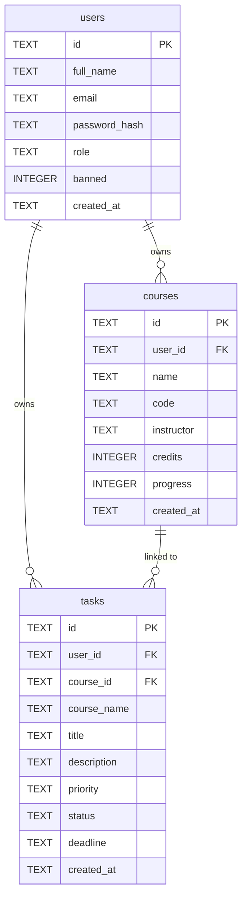

# StudyBalance — Entity Relationship Diagram

## ERD (Mermaid)

---

## ERD Explanation

### Entities

#### `users`
Stores all registered accounts, both students and the administrator.

| Column | Type | Description |
|---|---|---|
| `id` | TEXT (PK) | UUID generated at registration |
| `full_name` | TEXT | The user's full name |
| `email` | TEXT | Unique, case-insensitive email address |
| `password_hash` | TEXT | bcrypt hash of the user's password |
| `role` | TEXT | Either `'student'` or `'admin'` |
| `banned` | INTEGER | `0` = active, `1` = banned |
| `created_at` | TEXT | ISO 8601 timestamp set by SQLite default |

#### `courses`
Stores academic courses created by student users.

| Column | Type | Description |
|---|---|---|
| `id` | TEXT (PK) | UUID generated at creation |
| `user_id` | TEXT (FK → users.id) | The student who owns this course |
| `name` | TEXT | Full course name (e.g. "Software Engineering") |
| `code` | TEXT | Course code (e.g. "SE201") |
| `instructor` | TEXT | Instructor name (optional) |
| `credits` | INTEGER | Credit hours, constrained to 1–12 |
| `progress` | INTEGER | Completion percentage, 0–100 |
| `created_at` | TEXT | ISO 8601 timestamp |

#### `tasks`
Stores academic tasks created by student users, each linked to a course.

| Column | Type | Description |
|---|---|---|
| `id` | TEXT (PK) | UUID generated at creation |
| `user_id` | TEXT (FK → users.id) | The student who owns this task |
| `course_id` | TEXT (FK → courses.id, nullable) | The course this task belongs to; set to NULL if the course is deleted |
| `course_name` | TEXT | Denormalised course name stored for display purposes |
| `title` | TEXT | Task title |
| `description` | TEXT | Optional notes or details |
| `priority` | TEXT | One of: `'high'`, `'medium'`, `'low'` |
| `status` | TEXT | One of: `'pending'`, `'inprogress'`, `'completed'` |
| `deadline` | TEXT | ISO date string in `YYYY-MM-DD` format |
| `created_at` | TEXT | ISO 8601 timestamp |

---

### Relationships

#### users → courses (One-to-Many)
A single user can own zero or more courses. Each course belongs to exactly one user. The foreign key `courses.user_id` references `users.id`. If a user is deleted, all their courses are deleted automatically via `ON DELETE CASCADE`.

#### users → tasks (One-to-Many)
A single user can own zero or more tasks. Each task belongs to exactly one user. The foreign key `tasks.user_id` references `users.id`. If a user is deleted, all their tasks are deleted automatically via `ON DELETE CASCADE`.

#### courses → tasks (One-to-Many, optional)
A single course can have zero or more tasks linked to it. Each task optionally references one course via `tasks.course_id`. If a course is deleted, the `course_id` on all linked tasks is set to `NULL` via `ON DELETE SET NULL`. The `course_name` column is denormalised — it stores a copy of the course name at the time the task was created or last updated, so the task title remains readable even after the course is deleted.

---

### Database Indexes

The following indexes are defined to optimise common query patterns:

| Index | Column | Purpose |
|---|---|---|
| `idx_courses_user_id` | `courses.user_id` | Fast lookup of all courses for a given user |
| `idx_tasks_user_id` | `tasks.user_id` | Fast lookup of all tasks for a given user |
| `idx_tasks_course_id` | `tasks.course_id` | Fast lookup of all tasks for a given course |
| `idx_tasks_deadline` | `tasks.deadline` | Fast sorting and filtering by deadline |

---

### Notes on Design Decisions

- **UUIDs as primary keys** — all `id` fields use UUID-format text strings generated in application code rather than auto-incrementing integers. This avoids exposing sequential IDs in API responses and makes IDs globally unique.
- **Denormalised `course_name`** — the `tasks` table stores a copy of the course name. This ensures that task records remain readable in the admin task records view even if the associated course is later deleted.
- **No scenario table** — the What-If Scenario Simulator does not persist any data to the database. All simulation logic runs client-side using the task data already fetched from the API.
- **No session table** — authentication state is managed entirely through stateless JWTs. There is no server-side session store.
